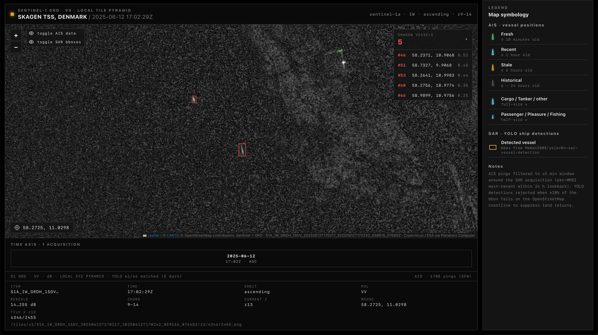
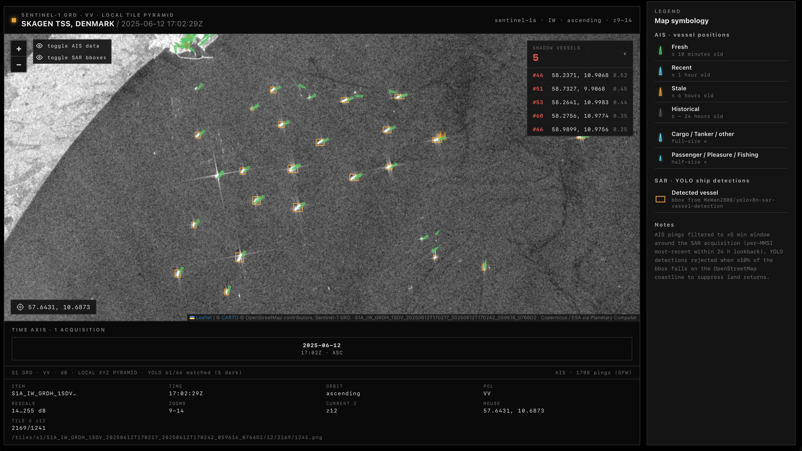

# Shadow Fleet Detector

Multi-INT fusion maritime webapp. Combines Sentinel-1 SAR ship detections (YOLO) with AIS vessel positions to surface dark / unreporting vessels.

📹 **Demo video:** https://www.loom.com/share/260e85692c2941339a15bf59b520fada


*Anomaly view: SAR detections with no matching AIS ping are flagged red — candidate dark vessels.*


*Nominal view: every SAR detection (amber bbox) pairs with an AIS report (green arrows) — no shadow fleet activity in scene.*

## What it does

Sanctioned operators run "shadow fleet" tankers that go silent on AIS to dodge tracking. Sentinel-1 SAR sees through clouds and darkness and images every vessel down to ~30 m hull length regardless of what its transponder is doing. This app fuses the two:

1. **Pulls a Sentinel-1 GRD scene** (VV polarization) over the area of interest from Microsoft Planetary Computer, dB-stretches it, and renders a local XYZ tile pyramid (zooms 9–14).
2. **Runs YOLOv8** (`MeWan2808/yolov8n-sar-vessel-detection`) over the SAR scene and writes per-scene detection bboxes.
3. **Filters land returns** by intersecting bboxes with the OSM coastline polygons (≥10% land overlap → drop), with a small list of manual exclusion polygons for unmapped offshore features.
4. **Loads AIS pings** from Danish Maritime Authority daily dumps, latest-per-MMSI within ±5 min of the SAR acquisition (24 h lookback).
5. **Greedy two-pass match**: each SAR detection claims the nearest unused AIS ping — pass 1 at ~150 m, pass 2 at 1 km (loose matches drawn with a white tether). Detections that find no AIS partner are flagged red as candidate dark vessels and listed in the side panel.

The frontend (React + Leaflet) lets the operator scrub through dates, see SAR + AIS overlaid, hover detections for size/confidence, and click any unmatched detection to fly to it.

## Stack

- **Backend**: Node + Express, TypeScript (`tsx`).
- **Frontend**: React + Vite, Leaflet maps.

## Setup

```bash
pnpm install
pnpm dev
```

Vite dev server runs on `http://localhost:3005` and proxies `/api/*` to the Express server on `:3000`.

## Production

```bash
pnpm build   # builds the frontend to dist/
pnpm start   # serves API + dist on PORT (default 3000)
```

## API

- `GET /api/ais-local?datetime=…&bbox=minLon,minLat,maxLon,maxLat` — latest-per-MMSI AIS pings from local DMA parquet files.

## Data & model credits

- **Sentinel-1 GRD** — ESA Copernicus, served via [Microsoft Planetary Computer](https://planetarycomputer.microsoft.com/) (free, open data).
- **AIS vessel tracks** — [Danish Maritime Authority](https://web.ais.dk/aisdata/) daily DMA dumps (CC BY 4.0).
- **OSM coastline** — [OpenStreetMap land polygons](https://osmdata.openstreetmap.de/data/land-polygons.html) (ODbL), used to filter SAR land returns.
- **YOLOv8 SAR vessel detector** — [`MeWan2808/yolov8n-sar-vessel-detection`](https://huggingface.co/MeWan2808/yolov8n-sar-vessel-detection) on Hugging Face.
- Basemap tiles: [CARTO](https://carto.com/attributions) dark matter, © OpenStreetMap contributors.

## Open-source libraries

Frontend: [React](https://react.dev), [Vite](https://vite.dev), [Leaflet](https://leafletjs.com) + [react-leaflet](https://react-leaflet.js.org), [TypeScript](https://www.typescriptlang.org).
Backend: [Node.js](https://nodejs.org), [Express](https://expressjs.com), [tsx](https://github.com/privatenumber/tsx), [DuckDB](https://duckdb.org), [dotenv](https://github.com/motdotla/dotenv), [cors](https://github.com/expressjs/cors), [concurrently](https://github.com/open-cli-tools/concurrently).
Pipeline (Python): [rasterio](https://rasterio.readthedocs.io), [rio-tiler](https://cogeotiff.github.io/rio-tiler/), [mercantile](https://github.com/mapbox/mercantile), [pystac-client](https://github.com/stac-utils/pystac-client), [planetary-computer](https://github.com/microsoft/planetary-computer-sdk-for-python), [Ultralytics YOLOv8](https://github.com/ultralytics/ultralytics), [GeoPandas](https://geopandas.org), [Shapely](https://shapely.readthedocs.io), [pandas](https://pandas.pydata.org), [pyarrow](https://arrow.apache.org/docs/python/), [NumPy](https://numpy.org), [Pillow](https://python-pillow.org), [huggingface_hub](https://github.com/huggingface/huggingface_hub).

Open-source / unclassified.
